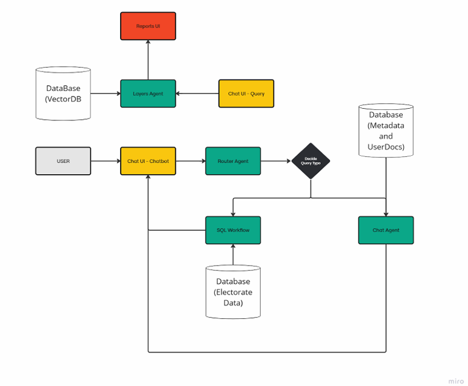

# PoliQ

The **PoliQ** project focused on integrating **Large Language Models (LLMs)** into an intelligent data platform to allow **natural language interaction** with complex datasets.

---

## Project Origin

The **PoliQ solution** was developed in response to growing demand in the political and civic sectors for more **accessible and efficient data tools**. 

We collaborated with PoliQ to expand the capabilities of their existing platform, **PoliMap**, by integrating a **chatbot interface** powered by cloud and local **LLMs**. The result was a scalable AI-driven platform that enables civil society organizations, advocacy groups, and policymakers to extract insights from structured and unstructured data using natural language queries.

---

## Project Objectives

- Integrate **LLMs** (cloud-based and local) to enable intelligent, conversational access to data
- Build a **Retrieval-Augmented Generation (RAG)** pipeline using a local document knowledge base
- Design effective **prompt engineering** workflows for accuracy and relevance
- Create a scalable backend using **Python, FastAPI, MongoDB, PostgreSQL**
- Develop a responsive **React frontend** for real-time user interaction
- Collaborate with an academic supervisor and client to deliver value in a real-world setting

---

## System Architecture

The system used a modular agent design for query routing, data access, and visualization:

### Architecture Components:
- **Chat UI (Chatbot + Query)**: User interface for querying structured and unstructured data
- **Router Agent**: Directs user queries to the correct processing pathway
- **Chat Agent**: Responds using documents and metadata via a vector database
- **SQL Workflow**: Interfaces with PostgreSQL for structured data queries
- **Layers Agent + Reports UI**: Provides aggregated insights and visual reports
- **VectorDB & Metadata DB**: Power the RAG pipeline and context-aware responses

---

## Contributions

- Conducted research on LLM applications, RAG design, and agent-based system architecture
- Helped implement prompt templates and test OpenAI and local model performance
- Supported the architecture definition in collaboration with team and supervisor
- Co-wrote technical documentation and maintained knowledge repo for prompt logic
- Created flow diagrams and design justification documents for chatbot-routing workflow
- Participated in Agile sprint planning, testing cycles, and mid-project client demos

---

## Project Documentation

[Final Report (PDF)](data/PoliQ_report.pdf)  
Architecture Diagram: `/assets/system arch..png`

Team repository: https://github.com/rajnaruka06/PoliQ

Polimap: https://github.com/PoliMap-Pro

---

## Technologies & Tools

- **Languages & Frameworks**: Python, FastAPI, React
- **AI/ML**: OpenAI, Local LLMs, Prompt Engineering, RAG
- **Databases**: MongoDB, PostgreSQL, Vector Database
- **Collaboration**: Git, GitHub

---
